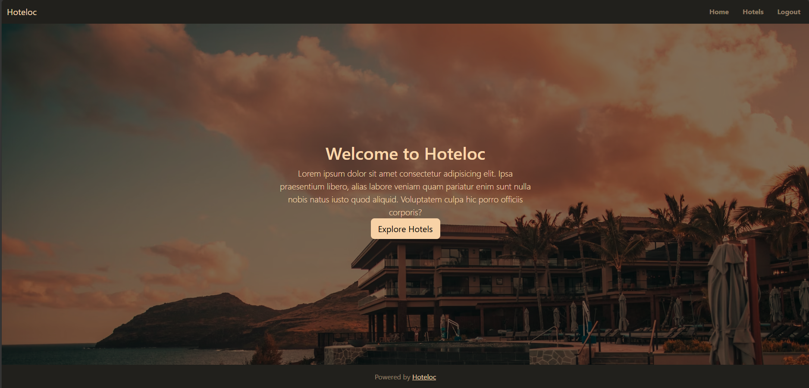
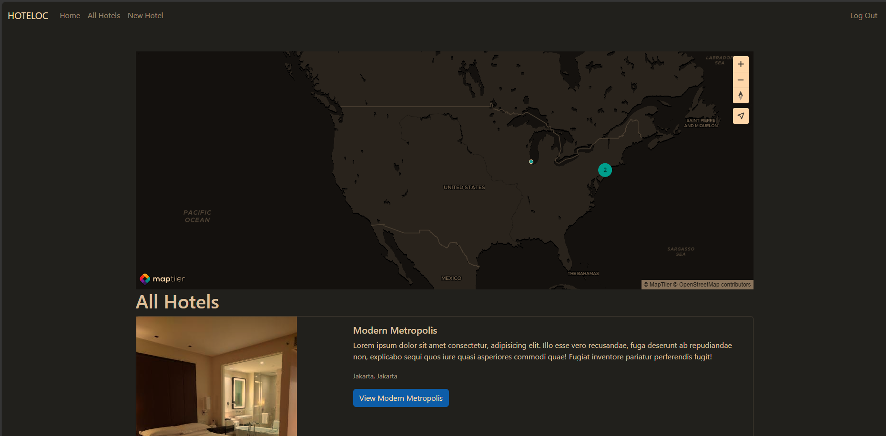

# Hoteloc

A web application for users to find and review hotels.

---

## Table of Contents
- Features
- Usage
- Screenshots

---

## Features
- User authentication and authorization
- Hotel listing and filtering
- Hotel review and rating system
- Map view of hotels using MapTiler
- Image upload and storage using Cloudinary
- Responsive design for mobile and desktop devices

---

## Usage
1. Open a web browser and navigate to `http://localhost:7810`.
2. Register or login to access the application features.
3. Browse hotels and filter by location or rating.
4. View hotel details and reviews.
5. Add new reviews and ratings for hotels.

---

## Screenshots

### Home Page

### Main Page

